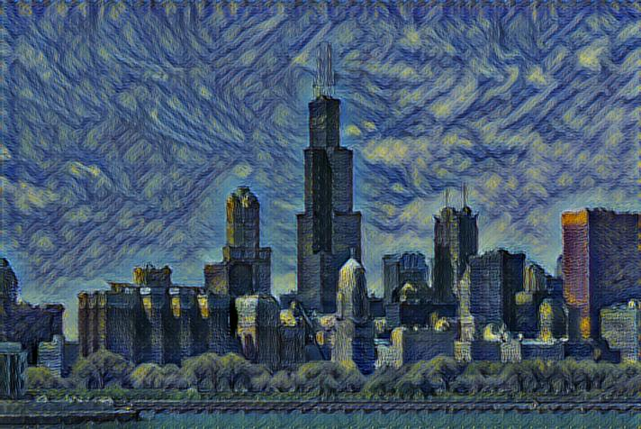
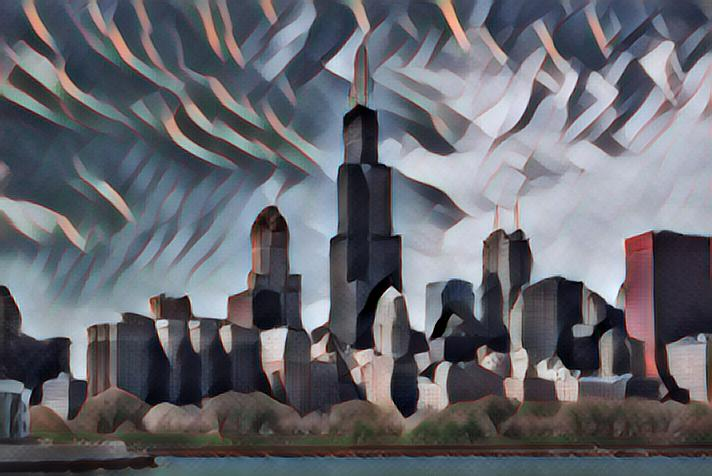
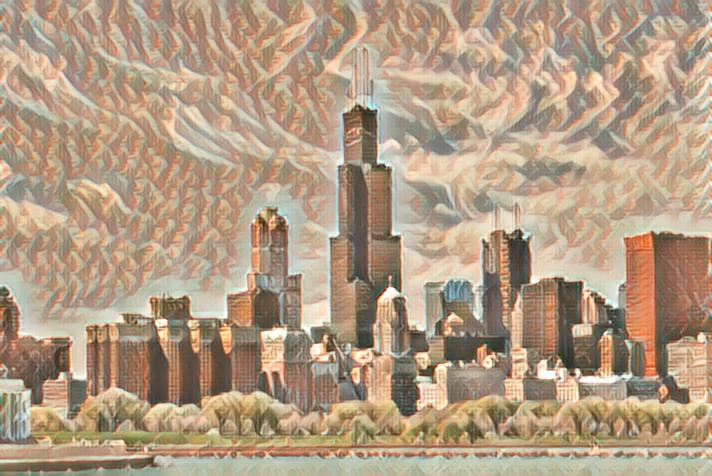
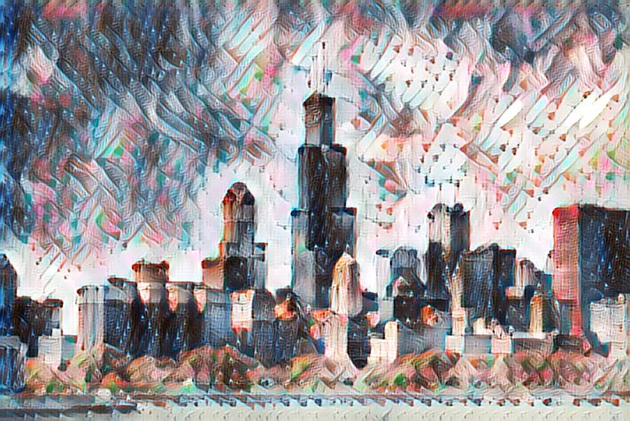

# Fast Style Transfer in TensorFlow 2 

This is an implementation of Fast-Style-Transfer on Python 3 and Tensorflow 2. 
The neural network is a combination of Gatys' [A Neural Algorithm of Artistic Style](https://arxiv.org/abs/1508.06576), Johnson's [Perceptual Losses for Real-Time Style Transfer and Super-Resolution](http://cs.stanford.edu/people/jcjohns/eccv16/), and Ulyanov's [Instance Normalization](https://arxiv.org/abs/1607.08022). 

## Image Stylization :art:
Added styles from various paintings to a photo of Chicago. Check the ./results folder to see more images.

     

 

 

All the models were trained on the same default setting.

## Implementation Details

- The **feed-forward network** is roughly the same as described in Johnson, except that batch normalization is replaced with Ulyanov's instance normalization, and the scaling/offset of the output `tanh` layer is slightly different (for better convergence), also use [Resize-convolution layer](https://distill.pub/2016/deconv-checkerboard/) to replace the regular transposed convolution for better upsampling (to avoid checkerboard artifacts)
- The **loss network** used in this implementation follows [Logan Engstrom](https://github.com/lengstrom/fast-style-transfer) , we are all similar to the one described in Gatys , using VGG19 instead of VGG16 and typically using "shallower" layers than in Johnson's implementation,  for larger scale style features in transformation (e.g. use `relu1_1` rather than `relu1_2`).

### Training Style Transfer Networks
Use `main.py` to train a new style transfer network.
Training takes 6 hours on a GTX 1060 3GB (when batch size is 2). 
**Before you run this, you should run `setup.sh` to download the dataset**. 

Example usage:

    python main.py train    \
      --style ./path/to/style/image.jpg \
      --dataset ./path/to/dataset \
      --weights ./path/to/weights \
      --batch 2    

### Evaluating Style Transfer Networks
Use `main.py` to evaluate a style transfer network. 
Evaluation takes 2s per frame on a GTX 1060 3GB. 

Example usage:

    python main.py evaluate    \
      --weights ./path/to/weights \
      --image ./path/to/content/image.jpg \
      --result ./path/to/save/results/image.jpg

### Requirements
You will need the following to run the above:
- TensorFlow 2.0 ↑
- Python 2.7.9, Pillow 3.4.2, scipy 0.18.1, numpy 1.11.2
- If you want to train (and don't want to wait for 4 months):
  - A decent GPU
  - All the required NVIDIA software to run TF on a GPU (cuda, etc)

### Attributions/Thanks
- Some readme/docs formatting was borrowed from Logan Engstrom's [fast-style-transfer](https://github.com/lengstrom/fast-style-transfer)
- Some code was borrowed from TensorFlow's official documents [Neural style transfer](https://www.tensorflow.org/tutorials/generative/style_transfer)